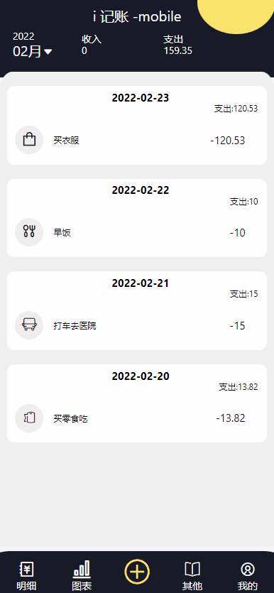

# 学生记账

This project was bootstrapped with [Create React App](https://github.com/facebook/create-react-app).

# Demo

## 字学镜像计划(前端篇)

https://bytedance.feishu.cn/docs/doccnL6DMX5mZ09NBUNieilr87b#

## Available Scripts

In the project directory, you can run:

### `yarn start`

Runs the app in the development mode.\
Open [http://localhost:3000](http://localhost:3000) to view it in the browser.

The page will reload if you make edits.\
You will also see any lint errors in the console.

### `yarn test`

Launches the test runner in the interactive watch mode.\
See the section about [running tests](https://facebook.github.io/create-react-app/docs/running-tests) for more information.

### `yarn build`

### Deployment

This section has moved here: [https://facebook.github.io/create-react-app/docs/deployment](https://facebook.github.io/create-react-app/docs/deployment)

https://facebook.github.io/create-react-app/docs/troubleshooting#npm-run-build-fails-to-minify)

### Tutorial

https://www.ruanyifeng.com/blog/2020/09/react-hooks-useeffect-tutorial.html

https://github.com/streamich/react-use

https://zhuanlan.zhihu.com/p/92211533